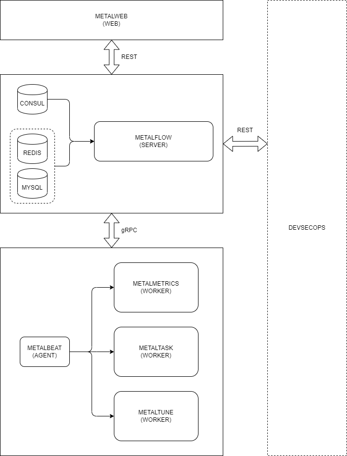

# metalmetrics-rs

[](https://github.com/craftslab/metalmetrics-rs/actions?query=workflow%3ACI)
[](https://github.com/craftslab/metalmetrics-rs/blob/master/LICENSE)
[](https://github.com/craftslab/metalmetrics-rs/tags)


## Introduction

*metalmetrics-rs* is a worker of *[metalflow](https://github.com/craftslab/metalflow/)* written in Rust.


## Prerequisites

- Lettre >= 0.9.6
- Rust >= 1.52.0


## Run

- **Local mode**

```bash
./metalmetrics-rs --config-file="config.yml" --inxi-file="inxi" --output-file="output.json"
```


- **Service mode**

```bash
./metalmetrics-rs --config-file="config.yml" --inxi-file="inxi" --listen-url="127.0.0.1:9090"
```


## Usage

```
USAGE:
    metalmetrics-rs [OPTIONS] --config_file <NAME>

OPTIONS:
        --config_file <NAME>    config file (.yml)
    -h, --help                  Print help information
        --inxi_file <NAME>      inxi file (/path/to/inxi)
        --listen_url <URL>      listen url (host:port)
        --output_file <NAME>    output file (.json|.txt|.xlsx)
    -V, --version               Print version information
```


## Settings

*metalmetrics-rs* parameters can be set in the directory [config](https://github.com/craftslab/metalmetrics-rs/blob/master/config).

An example of configuration in [config.yml](https://github.com/craftslab/metalmetrics-rs/blob/master/config/config.yml):

```yaml
apiVersion: v1
kind: worker
metadata:
  name: metalmetrics-rs
spec:
  metrics:
    - cpu
    - disk
    - io
    - ip
    - kernel
    - mac
    - network
    - os
    - ram
    - system
    - users
```


## Design




## License

Project License can be found [here](LICENSE).


## Reference

- [cargo-build](https://doc.rust-lang.org/cargo/commands/cargo-build.html)
- [gRPC](https://grpc.io/docs/languages/python/)
- [health-check-script](https://github.com/SimplyLinuxFAQ/health-check-script)
- [inxi](https://github.com/smxi/inxi)
- [python-diamond](https://github.com/python-diamond/Diamond)
- [rust-cheats](https://cheats.rs/)
- [rust-setup](https://docs.microsoft.com/en-us/windows/dev-environment/rust/setup)
- [sysperf](https://github.com/iandk/sysperf)
- [sysstat](https://github.com/sysstat/sysstat)
